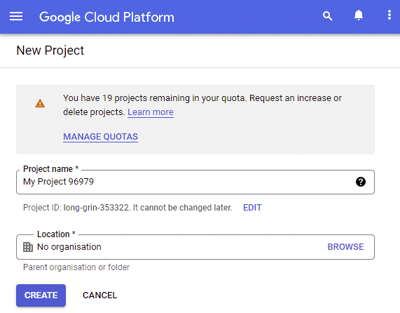
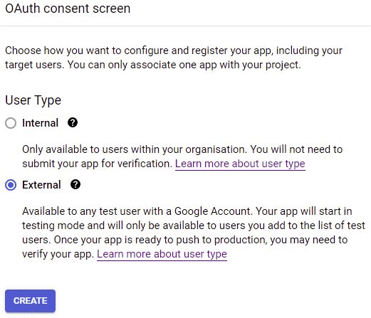
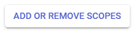
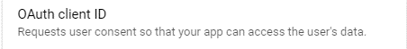
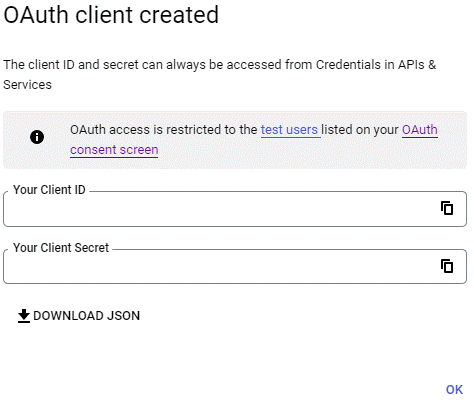
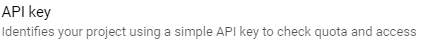
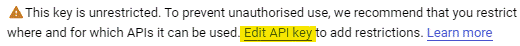

# Google API Powershell scripts

A bunch of powershell scripts for accessing several aspects of the google APIs such as:  
* Google Mail
* Google Calendar
* Google Drive

## Authorization
Each script relies on three values for authorization:  
* GoogleApiClientId
* GoogleApiClientSecret
* GoogleApiKey (not needed for google mail API)

These values must be provided the first time you use a script for a certain API. These values will then be stored in your profile directory beneath %USERPROFILE/.gapi/\<google-api-type>.json. Keep them save and protected for there are no restrictions concerning the activities against the API.  

Once provided, a browser windows will popup and ask you for permission to allow the script/set of *GoogleApiClientId* and *GoogleApiClientSecret* to perform the actions to the API(s). The popup will only occur once or if you delete the JSON file with the credentials beneath %USERPROFILE/.gapi/.

But how to get the values for GoogleApiClientId, GoogleApiClientSecret (and GoogleApiKey)?  
Well: they are provided by the [google developer console](https://foo.bar) which is accessible through your google account.  

The next chapter walks you through the steps of creating a new google cloud platform project, enable the fitting API for it and creating OAuth- and ApiKey-Credentials for using them as the parameter values.

### Create a new google cloud platform project
We first have to create a new project in order to create the credentials we need. The credentials are linked/assigned to the project.

1. Open the [google cloud platform console](https://console.cloud.google.com/welcome).
2. Select "IAM & Admin" -> "[Create a project](https://console.cloud.google.com/projectcreate)" from the menu.  

3. Select a project name of your choice (maybe Google Mail Powershell) and click "CREATE".

### Enable an API for the google cloud platform project
We need to assign one or more google APIs that we want to use to the project we created in the chapter before. 

1. Select the project from the dropdown list in the title bar. Make sure, your newly created project is currently the selected/active one (in the picture, it's 'GoogleDrivePowershell')!  

2. Select "APIs and services" -> "Enabled APIs and services" from the menu.
3. Click on the "+ ENABLE APIS AND SERVICES" button at the top of the screen.  

4. Search and choose your API (e.g. gmail API) and click on the "ENABLE" button for the selected API/service.

### Configure OAuth login/confirmation screen for the project
For we are using OAuth for authenticating against the google APIs we need to configure the consent screen, first.  
This is the same kind of screen you may know for confirming actions and/or information that i s used by a third party that is using google accounts.  

1. Click on "APIs and services" -> "OAuth consent screen" in the menu.
2. Choose external user type and click "CREATE".  

   1. Enter the App name for your screen.
   2. Select the "user support email".
   3. Enter the "Developer contact information".
   4. Click on "SAVE AND CONTINUE".
3. Click on "ADD OR REMOVE SCOPES".  

   1. Select your scope(s) (only activated scopes will be listed).
   2. Click the "UPDATE" button.  
   
   3. Click the "SAVE AND CONTINUE" button at the bottom of the screen/page.
4. Add your account to the test users.
   1. Click on "ADD USERS".
   2. Enter your google account email address and click "ADD".
   3. Click on "SAVE AND CONTINUE".
5. That's it - the OAuth consent screen is configured and ready.

### Add OAuth credentials to the project
OAuth credentials are needed for getting the values for *GoogleApiClientId* and *GoogleApiClientSecret*.  

1. Select "APIs and services" -> "Credentials" from the menu.
2. Click on "+ CREATE CREDENTIALS" and select "OAuth client ID".  
  

3. Select *Desktop app* for "Application type".
4. Choose a name for the OAuth credentials/client and click 'create'.  

5. The Client ID and the Client Secret are shown afterwards and are the correct values for the parameters *GoogleApiClientId* and *GoogleApiClientSecret*.  

### Add API Key to the project
An API key is needed for the scripts with the parameter *GoogleApiKey*.
1. Select "APIs and services" -> "Credentials" from the menu.
2. Click on "+ CREATE CREDENTIALS" and select "API key".  
  

3. Save the API key that is presented and click on "Edit API key".  

4. Select "Restrict key" under "API restrictions".
   1. Check the APIs you want to restrict the access to.
   2. Click "SAVE".
5. The generated API key can now be used for the *GoogleApiKey* parameter.

### Restrictions for the credentials
It is good practise to restrict the actions/things you can do with your credentials. This is achieved during the credential creation.  
The OAuth credentials are limited to the scope that was defined for the OAuth confirmation screen.  
The API keys kan be limited by their restrictions.